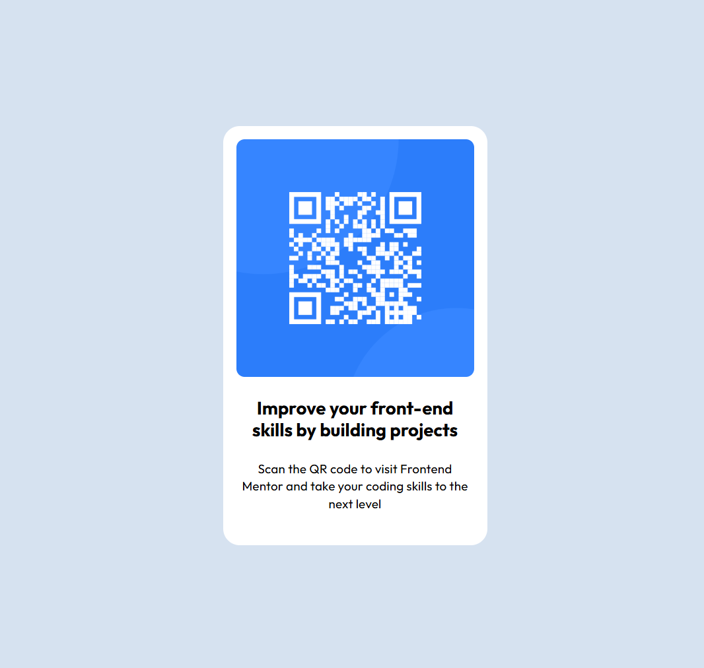

# Frontend Mentor - QR code component solution

This is a solution to the [QR code component challenge on Frontend Mentor](https://www.frontendmentor.io/challenges/qr-code-component-iux_sIO_H). Frontend Mentor challenges help you improve your coding skills by building realistic projects. 

## Table of contents

- [Frontend Mentor - QR code component solution](#frontend-mentor---qr-code-component-solution)
  - [Table of contents](#table-of-contents)
  - [Screenshot](#screenshot)
  - [Links](#links)
  - [Built with](#built-with)
  - [Author](#author)

## Screenshot

## Links

- Solution URL: [Add solution URL here](https://qr-code-component.shmuel.workers.dev/)

## Built with

- Semantic HTML5 markup
- CSS properties
- Flexbox
- [Astro](https://astro.build/) - JS Full Stack Framework
- [Cloudflare](https://www.cloudflare.com/)

## Author

- Website - [Shmuel Toporowitch](https://shmuel.dev)
- Frontend Mentor - [@shmuelTopo](https://www.frontendmentor.io/profile/shmuelTopo)
- Linkedin - [@shmuel-topo](https://www.linkedin.com/in/shmuel-topo/)